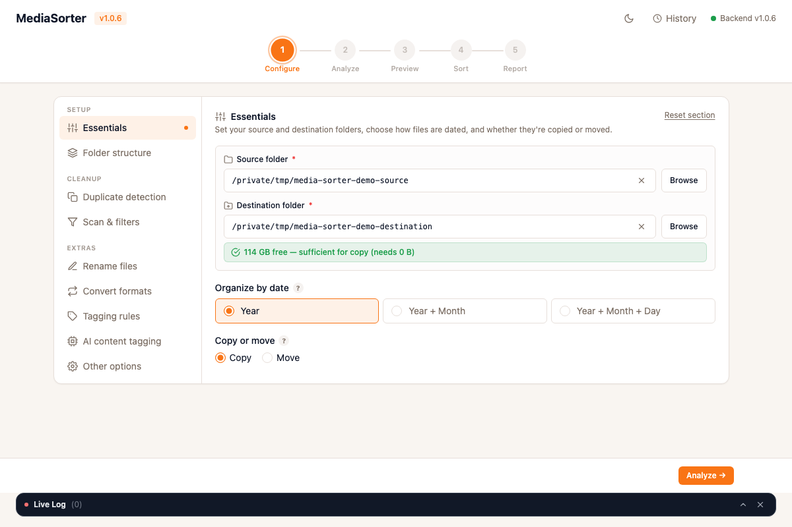

<div align="center">

# 📸 MediaSorter

**Point it at a messy folder of photos and videos. Get back a tidy, date-organised library.**

MediaSorter reads the real capture date of every file — from EXIF, video metadata,
the filename, or the filesystem — and files it away into a clean `YYYY / MM / DD`
hierarchy. It previews everything first, never deletes anything, and runs entirely
on your machine.

[](https://github.com/fileworks/media-sorter/actions/workflows/ci.yml)
[](LICENSE)


<!-- Drop a screenshot at docs/assets/screenshot.png — see docs/assets/README.md -->


</div>

---

## Why you'd want it

Phone exports, camera dumps, WhatsApp downloads, old backups — photo libraries turn
into chaos. MediaSorter untangles them **safely**:

- 🗓️ **Dates done right** — EXIF → video metadata → filename patterns → filesystem
  time, in that order, so files land in the right month even when metadata is missing.
- 👀 **Preview before anything moves** — a full dry-run shows exactly where every file
  will go. Nothing is touched until you say so.
- ♻️ **Nothing is ever deleted** — files that can't be placed (unknown/future date,
  duplicate, corrupted) go into clearly named quarantine folders you can review.
- 🖥️ **Self-contained** — no Python, Node, or ffmpeg to install. Download, open, done.

## How it works

A five-step wizard walks you through the whole thing:

**Configure → Analyse → Preview → Sort → Report**

1. **Configure** — pick source & destination, choose copy-vs-move, folder depth, rules.
2. **Analyse** — fast scan: how many files, what types, how much disk space, rough ETA.
3. **Preview** — dry-run with a per-category breakdown of exactly what will happen.
4. **Sort** — runs it for real, with a live progress bar and streaming log.
5. **Report** — per-file summary; export CSV/JSON; browse every past run.

## Features

| | |
|---|---|
| 🗓️ **Smart date extraction** | EXIF → video metadata → filename → filesystem mtime |
| 👀 **Preview / dry-run** | Full simulation with a 6-category breakdown |
| ♻️ **Duplicate detection** | SHA-256 exact + perceptual hash (images *and* video) |
| 🏷️ **Rule-based tagging** | Auto-tag by extension, size, resolution, or filename |
| 🧠 **AI content tagging** | Tag photos & videos by what's *in* them — runs **offline & free** on your machine (local CLIP), or use a free-tier cloud API. Tags are written into the files. |
| 🗃️ **Smart Categorization** | Auto-file each photo/video into your own topic folders (e.g. `baking`, `screenshots`, `receipts`) under the date — **offline & free**, only when it's confident; the rest go to `_uncategorized/`. |
| 📡 **Live log stream** | Real-time progress over WebSocket during a sort |
| 🗂️ **Operation history** | Every run saved to SQLite — browse and re-export |
| 📤 **CSV / JSON export** | Per-file report: source, destination, date source, tags |
| 🔁 **Format conversion** | Optional image/video transcoding via bundled ffmpeg |
| 🔔 **Update notifications** | Checks GitHub Releases and shows an in-app banner when a newer version ships |
| ⌨️ **Command-line interface** | Drive the backend headlessly — configure, scan, preview, sort, export (see below) |

---

## Download & install

> **No dependencies required** — Python, Node, and ffmpeg are all bundled inside the app.

1. Grab the latest build from the [**Releases**](https://github.com/fileworks/media-sorter/releases) page:
   - **macOS** — `MediaSorter_x.x.x_aarch64.dmg` (Apple Silicon) or `…_x64.dmg` (Intel)
   - **Windows** — `MediaSorter_x.x.x_x64_en-US.msi` (or the `…-setup.exe`)
2. Open / install and launch — the backend starts itself automatically.

First launch on an unsigned build may warn you:
- **macOS** — right-click → **Open** → **Open**.
- **Windows** — SmartScreen → **More info** → **Run anyway**.

Your config and history live in `~/Library/Application Support/mediasort/` (macOS) or
`%APPDATA%\mediasort\` (Windows).

If something goes wrong on startup, check the log files:

| Platform | Path |
|----------|------|
| macOS | `~/Library/Logs/MediaSorter/` |
| Windows | `%APPDATA%\MediaSorter\logs\` |
| Linux | `~/.local/share/mediasort/logs/` |

`mediasort.log` covers the launcher (port negotiation, process start/stop);
`backend.log` covers the Python backend (startup errors, sort activity).

---

## For developers

```bash
git clone https://github.com/fileworks/media-sorter.git
cd media-sorter
make install      # venv + npm + Rust toolchain check (one-time)
make dev          # backend (hot-reload) + Tauri window
```

Quality gates: **Ruff** + **mypy --strict** (backend) and **ESLint** + **Prettier**
(frontend).

```bash
make ci           # backend gate: ruff + mypy + pytest (≥80% coverage, currently ~86%)
cd frontend && npm run lint && npm test && npm run build   # frontend gate (eslint + vitest + build)
```

📖 **[docs/development.md](docs/development.md)** — setup, testing, building, and the
release flow in full.
🏗️ **[docs/design.md](docs/design.md)** — architecture and the *why* behind the design.
The live API is self-documenting at `http://127.0.0.1:<port>/api/docs` (OpenAPI).

### How it's built

A thin **Tauri (Rust)** shell launches a **FastAPI (Python)** backend on a free port
and tells the **React + TypeScript** frontend where to find it — they talk over plain
HTTP + a WebSocket. Releases bundle the frozen backend *and* static ffmpeg/ffprobe, so
end users install nothing. See [docs/design.md](docs/design.md) for the full picture.

---

## Running headless (Docker)

The desktop app needs a screen, but the backend runs fine as a headless service — handy
on a NAS or in a scheduled job:

```bash
MEDIA_SOURCE=~/Pictures MEDIA_DEST=~/Sorted docker compose up -d
docker compose logs -f backend     # reachable at http://localhost:8000
docker compose down
```

Config/history persist in the `mediasort-config` volume. Point the app at your folders
with `MEDIASORT_SOURCE_DIRECTORY` / `MEDIASORT_TARGET_DIRECTORY` (see `docker-compose.yml`).

---

## Command-line interface

Every step of the wizard is also available from a terminal — useful for headless runs,
cron jobs, or scripting against the backend. Start the backend (`make backend`, or the
Docker service above), then drive it with the CLI:

```bash
# Run from the repo root using the project venv (or your own with httpx + click installed)
backend/.venv/bin/python -m cli.main --help

# Typical flow
python -m cli.main config set --source ~/Pictures --target ~/Sorted --move
python -m cli.main config validate
python -m cli.main scan                 # list the media files that would be processed
python -m cli.main preview              # dry-run: where every file would land
python -m cli.main sort start --watch   # run for real, stream live progress
python -m cli.main sort report <task-id>
python -m cli.main report export <operation-id> --format csv -o report.csv
```

Point it at a non-default backend with `--api-url` (or `MEDIASORT_API_URL`). Commands:
`health`, `config show|set|validate`, `scan`, `preview`, `sort start|status|cancel|report`,
`report export`.

---

## Environment variables

All optional — the app resolves sane defaults. Any `Config` field can also be overridden
with `MEDIASORT_<FIELD>` (e.g. `MEDIASORT_SOURCE_DIRECTORY`, `MEDIASORT_AI_TAGGING_ENABLED=true`).

| Variable | Default | Purpose |
|----------|---------|---------|
| `MEDIASORT_CONFIG_DIR` | platform config dir | Redirects both `config.json` and `mediasort.db` (handy for Docker / parallel envs) |
| `MEDIASORT_DB_PATH` | `<config dir>/mediasort.db` | Overrides just the SQLite path (parent dir is created if missing) |
| `MEDIASORT_PORT` | `8000` | Port the backend binds to |
| `MEDIASORT_LOG_LEVEL` | `INFO` | Backend log level: `DEBUG` / `INFO` / `WARNING` / `ERROR` |
| `MEDIASORT_DEBUG` | `false` | Enables verbose/debug server behaviour |
| `MEDIASORT_CLIP_MODEL_DIR` | fastembed cache | Where the local CLIP model is cached/loaded from |
| `MEDIASORT_API_URL` | `http://localhost:8000` | Base URL the **CLI** talks to |

---

## Configuration

Everything is set through the **Configure** step, or by editing `config.json` in the
config directory. The essentials:

| Setting | Default | Description |
|---------|---------|-------------|
| `source_directory` | *(required)* | Folder to scan |
| `target_directory` | *(required)* | Where organised files go |
| `copy_instead_of_move` | `false` | `true` keeps originals; `false` moves them |
| `sort_criteria` | `["year"]` | Depth: `["year"]`, `["year","month"]`, `["year","month","day"]` |
| `recursive_scan` | `true` | Descend into subfolders |
| `preserve_subfolders` | `false` | `true` recreates source subfolders under each date folder; `false` flattens |
| `remove_duplicates` | `true` | Detect duplicates and quarantine them in `_duplicates/` (never deleted) |
| `rules_enabled` | `true` | Enable rule-based tagging |
| `ai_tagging_enabled` | `false` | Analyse photos/videos and tag them by content (metadata only) |
| `ai_tagging_provider` | `"local"` | `local` (offline, free) · `azure_vision` · `imagga` · `google_cloud_vision` |
| `categorize_enabled` | `false` | Sort files into your own topic folders (`…/Y/M/D/<category>/`) |
| `categorize_categories` | *(11 starters)* | Editable topic folder names (or auto-suggested from your photos) |
| `categorize_confidence_threshold` | `0.55` | How sure the model must be (0.50–0.99); below it → `_uncategorized/` |
| `ai_model_tier` | `"auto"` | Local AI engine: `auto` (hardware-picked) · `lite` (CLIP) · `standard`/`max` (SigLIP 2) · `off` |

> 📖 **Every setting is documented in [docs/settings-reference.md](docs/settings-reference.md)** —
> grouped by the same sections as the Configure screen, with defaults and plain-English descriptions.

### Smart Categorization

Turn on **Smart Categorization** to file each photo/video into *your own* topic folders —
e.g. `baking`, `screenshots`, `receipts` — nested under the date: `2024/03/15/baking/cake.jpg`.
It runs **fully offline and free** on the same local model as AI tagging, but it's a separate
feature: AI tagging writes *keywords into files*, while categorization decides *which folder a
file goes in* (it writes no tags). You can use either, both, or neither.

Files are only filed when the model is **confident** (tunable with
`categorize_confidence_threshold`, default 85%); anything it's unsure about goes to a
`_uncategorized/` folder rather than being guessed wrong — so nothing is mis-filed silently,
and the **Preview** step shows you the predicted folder for every file before you commit.

> 💡 Works best for topics with a **distinct look** (`screenshots`, `documents`, `food`,
> `pets`). Abstract ideas like `personal` or `work` classify poorly — the model sees pixels,
> not intent — and will mostly land in `_uncategorized/`.

Not sure what to call your folders? **"Suggest from photos"** clusters a sample of your source
images and proposes category names for you to accept with a click.

Smart Categorization replaces *Preserve source subfolders* (they organise files in conflicting
ways, so only one can be on); it can be combined with the per-camera subfolder.

### AI content tagging

Turn on **AI tagging** to have MediaSorter look at each photo/video and add descriptive
tags (e.g. *beach*, *document*, *dog*). The tags are saved into the report **and written
into the files themselves** — EXIF keywords for JPEG/TIFF (the Windows Explorer "Tags"
field), a `keywords` metadata tag for videos, or a portable `.xmp` sidecar for anything
else (PNG/HEIC/RAW). Toggle `ai_tagging_embed_in_files` off to keep tags in the report only.
AI tagging runs during a real sort, not in preview.

Choose a **provider**:

| Provider | Cost | What you need |
|----------|------|----------------|
| **Local** *(default)* | **Free, offline, no key** | Nothing — runs on your machine. The first sort downloads a one-time model (~a few hundred MB). Edit `ai_tagging_labels` to choose the vocabulary it scores against. |
| **Azure AI Vision** | Free **5,000/mo** (F0 tier) | Create a *Computer Vision* resource in the [Azure portal](https://portal.azure.com) → set `ai_tagging_endpoint` + `ai_tagging_api_key`. |
| **Imagga** | Free **~1,000/mo** | Sign up at [imagga.com](https://imagga.com/auth/signup) → set `ai_tagging_api_key` + `ai_tagging_api_secret`. |
| **Google Cloud Vision** | Free **1,000/mo** | Enable the [Vision API](https://console.cloud.google.com/apis/library/vision.googleapis.com) and create an API key → set `ai_tagging_api_key`. |

`ai_tagging_max_tags` caps how many tags are written per file; `ai_tagging_confidence_threshold`
(0–1) sets the minimum confidence to keep a tag.

The **local** engine is hardware-aware: MediaSorter probes your CPU/RAM/GPU and recommends a
model tier — `lite` (CLIP, runs anywhere) or `standard`/`max` (SigLIP 2, more accurate, one-time
~100 MB download). On a machine below the minimum it auto-disables local AI and points you to a
cloud provider instead. Pick a heavier tier than recommended and the UI flags it *"may be slow"*.

Tagging rules match on `extension`, `filename_contains`, `size` (bytes), or `resolution`
(`"WxH"`) with operators `eq` / `gt` / `lt` / `gte` / `lte`. Example:

```json
{
  "rules_enabled": true,
  "rules": [
    { "id": "r1", "name": "4K Videos", "tag": "4K",
      "condition": { "type": "resolution", "operator": "gt", "value": "3840x2160" } },
    { "id": "r2", "name": "RAW photos", "tag": "RAW",
      "condition": { "type": "extension", "value": "raw" } }
  ]
}
```

---

## Contributing

1. Fork and branch off `main`.
2. Make your change (keep new backend code covered by tests).
3. `make ci` must pass; for frontend changes, `npm run lint && npm run build` too.
4. Open a PR. Commits follow [Conventional Commits](https://www.conventionalcommits.org/)
   (`fix:` / `feat:`) — that's what drives versioning and releases.

## License

[MIT](LICENSE) © Niklas Büchel
