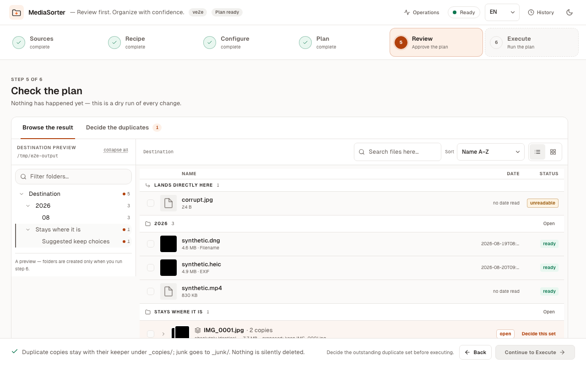

<div align="center">


# 📸 MediaSorter

**Point it at a messy folder of photos and videos. Get back a tidy, date-organised library.**

MediaSorter reads the real capture date of every file — from EXIF, video metadata,
the filename, or the filesystem — and files it away into a clean `YYYY / MM / DD`
hierarchy. It previews everything first, never deletes anything, and runs entirely
on your machine.

[](https://github.com/fileworks/media-sorter/actions/workflows/ci.yml)
[](https://github.com/fileworks/media-sorter/releases/tag/v1.0.6)
[](LICENSE)




</div>

---

## Status

Released **v1.0.6** — installers for macOS (Apple Silicon and Intel), Windows
(MSI and NSIS), and a portable ZIP, published as a GitHub Release. There is no
package-manager channel for the desktop application.

## Overview

MediaSorter cleans up a photo and video collection **offline, on your own
machine**: it sorts by date, finds exact and visually similar duplicates, filters
out thumbnails and junk, and optionally tags and categorises with local AI. It
never uploads anything.

Its default profile is *Organize Only*: files are copied or moved and verified
byte for byte, and nothing inside a file is ever rewritten unless you explicitly
opt in. Duplicates go to quarantine, never to the bin.

Recognized companion files stay attached to their media by default: XMP/AAE
edits, Live Photo motion, RAW siblings, video thumbnails, and audio notes share
one date, route, rename, collision suffix, and duplicate outcome. Preview shows
every binding and any split risk before execution.

## Why you'd want it

Phone exports, camera dumps, WhatsApp downloads, old backups — photo libraries turn
into chaos. MediaSorter untangles them **safely**:

- 🗓️ **Dates done right** — EXIF → video metadata → filename patterns → filesystem
  time, in that order, so files land in the right month even when metadata is missing.
- 👀 **Preview before anything moves** — a full dry-run shows exactly where every file
  will go. Nothing is touched until you say so.
- ♻️ **Nothing is ever deleted** — files that can't be placed (unknown/future date,
  duplicate, corrupted) go into clearly named quarantine folders you can review.
- 🖥️ **Self-contained** — no Python, Node, or ffmpeg to install. Download, open, done.

## How it works

The desktop interface has three durable stages:

**Sources → Review → Execute**

1. **Sources** — assign input, reference, and destination roles; choose a recipe
   or edit any setting; scan the selected folders without changing them.
2. **Review** — inspect organization, exact duplicates, similar media,
   validation findings, and issues. Preview paths and consequences before
   anything moves.
3. **Execute** — read the impact summary, deliberately confirm the exact plan,
   follow live progress, and open the final report. The operation center keeps
   current and recent work reachable from every stage.

## Features

| | |
|---|---|
| 🗓️ **Smart date extraction** | EXIF → video metadata → filename → filesystem mtime |
| 👀 **Preview / dry-run** | Full simulation with a 6-category breakdown |
| ♻️ **Duplicate detection** | SHA-256 exact + perceptual hash (images *and* video) |
| 🏷️ **Rule-based tagging** | Auto-tag by extension, size, resolution, or filename |
| 🧠 **AI content tagging** | Tag photos & videos by what's *in* them — runs **offline & free** on your machine (local CLIP), or use a free-tier cloud API. Tags are written into the files. |
| 🗃️ **Smart Categorization** | Auto-file each photo/video into your own topic folders (e.g. `baking`, `screenshots`, `receipts`) under the date — **offline & free**, only when it's confident; the rest go to `_uncategorized/`. |
| 📡 **Live log stream** | Real-time progress over WebSocket during a sort |
| 🗂️ **Operation history** | Every run saved to SQLite — browse and re-export |
| 📤 **CSV / JSON export** | Per-file report: source, destination, date source, tags |
| 🔁 **Format conversion** | Optional image/video transcoding via bundled ffmpeg |
| 🔔 **Update notifications** | Checks GitHub Releases and shows an in-app banner when a newer version ships |
| ⌨️ **Command-line interface** | Drive the backend headlessly — configure, scan, preview, sort, export (see below) |

---

## Download & install

> **No dependencies required** — Python, Node, and ffmpeg are all bundled inside the app.

1. Grab the latest build from the [**Releases**](https://github.com/fileworks/media-sorter/releases) page:
   - **macOS** — `MediaSorter_x.x.x_aarch64.dmg` (Apple Silicon) or `…_x64.dmg` (Intel)
   - **Windows** — `MediaSorter_x.x.x_x64_en-US.msi` (or the `…-setup.exe`)
2. Open / install and launch — the backend starts itself automatically.

The current `v1.0.6` installers are unsigned, so the first launch may warn you:

- **macOS** — right-click → **Open** → **Open**.
- **Windows** — SmartScreen → **More info** → **Run anyway**.

State now follows stable `PlatformDirs("MediaSorter", appauthor=False)` roots:

| Platform | Config | History database | Logs |
|---|---|---|---|
| macOS | `~/Library/Application Support/MediaSorter/config.json` | `~/Library/Application Support/MediaSorter/mediasort.db` | `~/Library/Logs/MediaSorter/` |
| Windows | `%LOCALAPPDATA%\MediaSorter\config.json` | `%LOCALAPPDATA%\MediaSorter\mediasort.db` | `%LOCALAPPDATA%\MediaSorter\Logs\` |
| Linux | `${XDG_CONFIG_HOME:-~/.config}/MediaSorter/config.json` | `${XDG_DATA_HOME:-~/.local/share}/MediaSorter/mediasort.db` | `${XDG_STATE_HOME:-~/.local/state}/MediaSorter/log/` |

`mediasort.log` covers the launcher; `backend.log` covers Python. Historical
lowercase state is copied non-destructively on first startup, with conflicts and
recovery files preserved. See
[state paths, migration, and recovery](docs/state-and-recovery.md).

---

## For developers

```bash
git clone https://github.com/fileworks/media-sorter.git
cd media-sorter
make install      # venv + npm + Rust toolchain check (one-time)
make dev          # backend (hot-reload) + Tauri window
```

Quality gates: **Ruff** + **mypy --strict** (backend) and **ESLint** + **Prettier**
(frontend).

```bash
make ci           # backend gate: ruff + mypy + pytest (≥80% coverage, currently ~86%)
cd frontend && npm run lint && npm test && npm run build   # frontend gate (eslint + vitest + build)
```

For per-clone paths, commands, or preferences, create an ignored
`CLAUDE.local.md` at the repository root. The committed `CLAUDE.md` remains the
project guidance for standalone clones. Do not put credentials or other secrets
in the local file.

📖 **[docs/development.md](docs/development.md)** — setup, testing, building, and the
release flow in full.
🏗️ **[docs/design.md](docs/design.md)** — architecture and the *why* behind the design.
🔏 **[docs/release-signing.md](docs/release-signing.md)** — optional signing,
verification, and manual enrollment gates.
The live API is self-documenting at `http://127.0.0.1:<port>/api/docs` (OpenAPI).

### How it's built

A thin **Tauri (Rust)** shell launches a **FastAPI (Python)** backend on a free port
and tells the **React + TypeScript** frontend where to find it — they talk over plain
HTTP + a WebSocket. Releases bundle the frozen backend *and* static ffmpeg/ffprobe, so
end users install nothing. See [docs/design.md](docs/design.md) for the full picture.

---

## Running headless (Docker)

The desktop app needs a screen, but the backend runs fine as a headless service — handy
on a NAS or in a scheduled job:

```bash
MEDIA_SOURCE=~/Pictures MEDIA_DEST=~/Sorted docker compose up -d
docker compose logs -f backend     # reachable at http://localhost:8000
docker compose down
```

Config/history persist in the `mediasort-config` volume. Point the app at your folders
with `MEDIASORT_SOURCE_DIRECTORY` / `MEDIASORT_TARGET_DIRECTORY` (see `docker-compose.yml`).

---

## Quick start

1. Install from the [latest release](https://github.com/fileworks/media-sorter/releases).
2. Point it at a source folder and a destination folder.
3. Run **Analyze**, then **Preview** — nothing has moved yet.
4. Read the preview, then **Sort**.

Every step before Sort is read-only.

## Command-line interface

The same scan, preview, execute, and report operations are available from a terminal — useful for headless runs,
cron jobs, or scripting against the backend. Start the backend (`make backend`, or the
Docker service above), then drive it with the CLI:

```bash
# Run from the repo root using the project venv (or your own with httpx + click installed)
backend/.venv/bin/python -m cli.main --help

# Typical flow
python -m cli.main config set --source ~/Pictures --target ~/Sorted --move
python -m cli.main config validate
python -m cli.main scan                 # list the media files that would be processed
python -m cli.main preview              # dry-run: where every file would land
python -m cli.main sort start --watch   # run for real, stream live progress
python -m cli.main sort report <task-id>
python -m cli.main report export <operation-id> --format csv -o report.csv
```

Point it at a non-default backend with `--api-url` (or `MEDIASORT_API_URL`). Commands:
`health`, `config show|set|validate`, `scan`, `preview`, `sort start|status|cancel|report`,
`report export`.

---

## Usage

The graphical application is the primary interface; the
[command-line interface](#command-line-interface) below drives the same backend
for scripted and headless runs.

## Environment variables

All optional — the app resolves sane defaults. Any `Config` field can also be overridden
with `MEDIASORT_<FIELD>` (e.g. `MEDIASORT_SOURCE_DIRECTORY`, `MEDIASORT_AI_TAGGING_ENABLED=true`).

| Variable | Default | Purpose |
|----------|---------|---------|
| `MEDIASORT_CONFIG_DIR` | platform config dir | Redirects `config.json`; also keeps the legacy shared data/database behavior when no newer data/database override is set |
| `MEDIASORT_DATA_DIR` | platform non-roaming data dir | Redirects data and the default parent of `mediasort.db` |
| `MEDIASORT_DB_PATH` | `<data dir>/mediasort.db` | Overrides the exact SQLite path |
| `MEDIASORT_LOG_DIR` | platform log dir | Redirects both launcher and backend logs |
| `MEDIASORT_PORT` | `8000` | Port the backend binds to |
| `MEDIASORT_LOG_LEVEL` | `INFO` | Backend log level: `DEBUG` / `INFO` / `WARNING` / `ERROR` |
| `MEDIASORT_DEBUG` | `false` | Enables verbose/debug server behaviour |
| `MEDIASORT_MODEL_DIR` | platform data dir / `ai-models` | Application-managed directory for verified optional AI model packs |
| `MEDIASORT_MODEL_MIRROR_URL` | Hugging Face pinned revisions | Optional HTTPS mirror root for self-hosted model packs |
| `MEDIASORT_API_URL` | `http://localhost:8000` | Base URL the **CLI** talks to |

---

## Configuration

Everything is set on the **Sources** stage, or by editing `config.json` in the
config directory. The essentials:

| Setting | Default | Description |
|---------|---------|-------------|
| `language` | `"en"` | Interface and future generated labels: English or German |
| `source_directory` | *(required)* | Folder to scan |
| `target_directory` | *(required)* | Where organised files go |
| `copy_instead_of_move` | `false` | `true` keeps originals; `false` moves them |
| `sort_criteria` | `["year"]` | Depth: `["year"]`, `["year","month"]`, `["year","month","day"]` |
| `recursive_scan` | `true` | Descend into subfolders |
| `preserve_subfolders` | `false` | `true` recreates source subfolders under each date folder; `false` flattens |
| `remove_duplicates` | `true` | Detect duplicates and quarantine them in `_duplicates/` (never deleted) |
| `companion_handling` | `keep_with_primary` | Keep recognized companion files with their primary; alternatives are `leave_in_place` and `ignore` |
| `rules_enabled` | `true` | Global switch for deterministic rules |
| `rule_set` | `{"version":1,"tag_rules":[],"route_rules":[]}` | Typed tag and safe-routing rules |
| `ai_tagging_enabled` | `false` | Analyse photos/videos and tag them by content (metadata only) |
| `ai_tagging_provider` | `"local"` | `local` (offline, free) · `azure_vision` · `imagga` · `google_cloud_vision` |
| `categorize_enabled` | `false` | Sort files into your own topic folders (`…/Y/M/D/<category>/`) |
| `categorize_categories` | *(11 starters)* | Editable topic folder names (or auto-suggested from your photos) |
| `categorize_confidence_threshold` | `0.55` | How sure the model must be (0.50–0.99); below it → `_uncategorized/` |
| `ai_model_tier` | `"auto"` | Local AI engine: `auto` (hardware-picked) · `lite` (CLIP) · `standard`/`max` (SigLIP 2) · `off` |

> 📖 **Every setting is documented in [docs/settings-reference.md](docs/settings-reference.md)** —
> grouped by the same sections as the Sources screen, with defaults and plain-English descriptions.

### Smart Categorization

Turn on **Smart Categorization** to file each photo/video into *your own* topic folders —
e.g. `baking`, `screenshots`, `receipts` — nested under the date: `2024/03/15/baking/cake.jpg`.
It runs **fully offline and free** on the same local model as AI tagging, but it's a separate
feature: AI tagging writes *keywords into files*, while categorization decides *which folder a
file goes in* (it writes no tags). You can use either, both, or neither.

Files are only filed when the model is **confident** (tunable with
`categorize_confidence_threshold`, default 0.55); anything it's unsure about goes to a
`_uncategorized/` folder rather than being guessed wrong — so nothing is mis-filed silently,
and the **Preview** step shows you the predicted folder for every file before you commit.

> 💡 Works best for topics with a **distinct look** (`screenshots`, `documents`, `food`,
> `pets`). Abstract ideas like `personal` or `work` classify poorly — the model sees pixels,
> not intent — and will mostly land in `_uncategorized/`.

Not sure what to call your folders? **"Suggest from photos"** clusters a sample of your source
images and proposes category names for you to accept with a click.

Smart Categorization replaces *Preserve source subfolders* (they organise files in conflicting
ways, so only one can be on); it can be combined with the per-camera subfolder.

### AI content tagging

Turn on **AI tagging** to have MediaSorter look at each photo/video and add descriptive
tags (e.g. *beach*, *document*, *dog*). The tags are saved into the report **and written
into the files themselves** — EXIF keywords for JPEG/TIFF (the Windows Explorer "Tags"
field), a `keywords` metadata tag for videos, or a portable `.xmp` sidecar for anything
else (PNG/HEIC/RAW). Toggle `embed_tags_in_files` off to keep deterministic and AI tags in
the report only.
AI tagging runs during a real sort, not in preview.

Choose a **provider**:

| Provider | Cost | What you need |
|----------|------|----------------|
| **Local** *(default)* | **Free, offline, no key** | Install the selected model once from the AI settings. Files are pinned and checksum-verified, and inference is offline. Edit `ai_tagging_labels` to choose the vocabulary it scores against. |
| **Azure AI Vision** | Free **5,000/mo** (F0 tier) | Create a *Computer Vision* resource in the [Azure portal](https://portal.azure.com) → set `ai_tagging_endpoint` + `ai_tagging_api_key`. |
| **Imagga** | Free **~1,000/mo** | Sign up at [imagga.com](https://imagga.com/auth/signup) → set `ai_tagging_api_key` + `ai_tagging_api_secret`. |
| **Google Cloud Vision** | Free **1,000/mo** | Enable the [Vision API](https://console.cloud.google.com/apis/library/vision.googleapis.com) and create an API key → set `ai_tagging_api_key`. |

`ai_tagging_max_tags` caps how many tags are written per file; `ai_tagging_confidence_threshold`
(0–1) sets the minimum confidence to keep a tag.

The **local** engine is hardware-aware: MediaSorter probes your CPU/RAM/GPU and recommends a
model tier — `lite` (CLIP, runs anywhere) or `standard`/`max` (SigLIP 2, more accurate). Model
files are optional and installed explicitly from the AI settings. On a machine below the minimum it auto-disables local AI and points you to a
cloud provider instead. Pick a heavier tier than recommended and the UI flags it *"may be slow"*.

Rules match the source file on `extension`, `filename_contains`, `size` (bytes), or
`resolution` (`"WxH"`). All matching tag rules run; the first matching route rule adds a
strict relative suffix after the normal date/category/camera path. Priorities sort ascending,
with saved order breaking ties. Preview and sort share `_001`, `_002`, … collision planning.
Example:

```json
{
  "rule_set": {
    "version": 1,
    "tag_rules": [],
    "route_rules": [
      {
        "id": "screenshots",
        "name": "Screenshots",
        "enabled": true,
        "priority": 10,
        "condition": {"type": "filename_contains", "value": "screenshot"},
        "relative_folder": "screenshot"
      }
    ]
  }
}
```

With year/month sorting, `Screenshot 2026-07-04.png` previews as
`2026/07/screenshot/Screenshot 2026-07-04.png`. Routes never affect technical quarantine
folders. Legacy tag rules are backed up and migrated once; see the
[settings reference](docs/settings-reference.md#rules-tagging-and-routing).

---

## Troubleshooting

**"Completed, 0 files sorted".** A source folder that is not mounted used to look
like an empty library. It now fails with an actionable message — if you see the
old behaviour, the drive is mounted but empty.

**The window is blank on launch.** A static splash renders before React mounts;
a persistent blank screen means the backend did not start. Check the log
location reported by `GET /api/diagnostics`.

**Windows GPU acceleration is not used.** Check the reported ONNX providers under
Settings; `DmlExecutionProvider` must be present.

**An operation needs review after a crash.** Startup reconciliation classifies
what it can prove and asks about the rest. Nothing is deleted while a decision is
outstanding — see [docs/state-and-recovery.md](docs/state-and-recovery.md).

## Development

See [CONTRIBUTING.md](CONTRIBUTING.md) for the full gate. In short:

```console
cd backend && uv sync --all-extras --dev && uv run pytest -q
cd frontend && npm ci && npm run lint && npm test && npm run build
```

The knowledge base under [`docs/`](docs/) is the reference for backend, API,
testing, and the preservation, observability, catalog, and duplicate-review
contracts, including [read-only library audits](docs/library-audit.md).

## Contributing

1. Fork and branch off `main`.
2. Make your change (keep new backend code covered by tests).
3. `make ci` must pass; for frontend changes, `npm run lint && npm run build` too.
4. Open a PR. Commits follow [Conventional Commits](https://www.conventionalcommits.org/)
   (`fix:` / `feat:`) — that's what drives versioning and releases.

## Security

Report vulnerabilities privately as described in [SECURITY.md](SECURITY.md).
MediaSorter runs entirely locally: the backend binds to `127.0.0.1`, and the only
outbound request is the optional update check.

## License

[MIT](LICENSE) © Niklas Büchel
