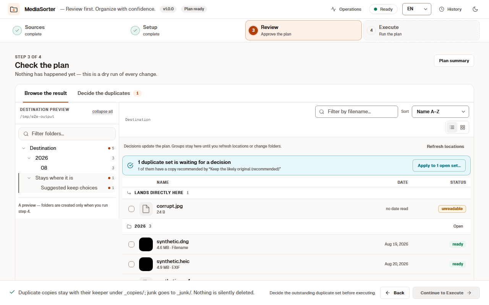

<div align="center">


# 📸 MediaSorter

**Review first. Organize photos and videos with confidence.**

[](https://github.com/fileworks/media-sorter/actions/workflows/ci.yml)
[](https://github.com/fileworks/media-sorter/releases/latest)
[](LICENSE)




*Current source UI with disposable demonstration media. See [capture details](docs/assets/README.md).*

</div>

## Overview

MediaSorter turns mixed camera, phone, messenger, and backup folders into a
reviewed date-organized library. It extracts capture dates, keeps companion
files together, detects duplicate and similar media, and can categorize or tag
content with optional local AI. Processing and tagging stay on your machine;
the application has no cloud media provider or credential path.

## Install

Download the latest macOS DMG, Windows MSI/installer, or portable Windows ZIP
from [Releases](https://github.com/fileworks/media-sorter/releases/latest).
No separate Python, Node, or ffmpeg installation is required. The package
contains the frozen Python backend, built frontend assets, and bundled
ffmpeg/ffprobe media tools. The macOS build requires macOS 12 or later,
matching the minimum version of its bundled media tools.

The installers are currently unsigned. On supported macOS 12 through 14, if
Gatekeeper blocks the first launch, Control-click the app, choose **Open**, and
confirm **Open**. On macOS 15 Sequoia and later, after the blocked launch open
**System Settings > Privacy & Security**, scroll to **Security**, choose
**Open Anyway** beside MediaSorter, and confirm **Open**. On Windows, choose
**More info > Run anyway** in SmartScreen only for the verified Fileworks
download.

See the [installation guide](docs/install.md) for the correct CPU/installer,
checksum commands and updates. Desktop downloads need no account.

## Status

The latest verified public release is listed on the
[Releases page](https://github.com/fileworks/media-sorter/releases/latest).
Installers remain unsigned by the recorded project decision; the release page
publishes checksums, but those checksums do not prove publisher identity.

## Quick start

Open MediaSorter, add at least one input and one destination on **Sources**,
choose a recipe in **Setup**, calculate the plan, resolve any duplicate decisions,
and execute only after reviewing the frozen impact summary.

## Usage

### Desktop workflow

The application makes every mutation wait behind one reviewed plan:

1. **Sources** — assign input, reference, and destination folders. A whole root
   can be skipped for one run without changing the saved profile.
2. **Setup** — choose a recipe, then adjust movement, structure, cleanup, metadata
   and optional AI settings. Calculate the read-only plan from these settings.
3. **Review** — inspect the impact summary and planned destinations, verify the
   destination and space, and resolve every duplicate or similar-media set.
   Preview and scanning remain read-only.
4. **Execute** — confirm the frozen impact summary, follow progress, and inspect
   the final report.

Returning to folders or settings invalidates the dependent plan instead of
silently executing stale decisions. Interrupted operations are reconciled at
startup before new work is allowed.

## Safety model

- Source scanning, analysis, preview, and review are read-only.
- Copies are staged and verified before publication. Same-volume moves use an
  atomic no-replace rename on macOS/Linux and protected link publication on Windows.
  Cross-volume moves remove the source only when both files can be protected
  through removal. macOS/Linux retain the source and report an actionable error;
  use Copy mode for transfers between volumes on those platforms.
- Existing destination content is indexed before execution. Exact matches are
  reported without another write.
- Extra duplicate copies are never silently deleted. They go to root-level
  `_copies/`, mirroring the selected file's folders (`_copies/Y/M/D/…`). Their
  own metadata and original paths remain in the report.
- XMP/AAE edits, Live Photo motion, RAW siblings, thumbnails, and audio notes
  travel as bounded media units by default. Unsafe splits block execution.
- Reference roots are immutable and enforced by the executor.
- Collision names are deterministic, and the same planner drives preview and
  execution.

Keep independent backups: verification protects each operation, not storage
failures that happen later. The complete contract is in
[preservation guarantees](docs/preservation-guarantees.md).

## Highlights

| Capability | What it does |
|---|---|
| Date extraction | EXIF → video metadata → filename → filesystem time |
| Organization | Deterministic year/month/day, source, camera, category, and rule routes |
| Duplicate review | SHA-256 exact matches, perceptual image/video groups, keyboard Resolve queue, and side-by-side comparison |
| Companion media | One placement, rename, collision, and duplicate outcome per media unit |
| Rules | Typed tagging and safe relative routing with previewed effects |
| Local AI | Optional checksum-pinned CLIP/SigLIP model packs for offline tagging and categorization |
| Reporting | Live progress, SQLite history, detailed provenance, and CSV/JSON export |
| Recovery | Startup reconciliation, support bundles, and explicit operator decisions for uncertain outcomes |
| Languages | Complete English and German interfaces |

## Configuration

The [settings reference](docs/settings-reference.md) documents every option,
default, compatibility gate, model tier, environment override, and routing
rule. The in-app descriptions and previews are the primary configuration UI.

Use the in-app **Setup** screen for saved settings and immediate folder and
filename previews. For headless deployments, the settings reference lists the
equivalent environment and API controls, including validation and safe
defaults.

## State and logs

MediaSorter uses stable platform directories:

| Platform | Config and history | Logs |
|---|---|---|
| macOS | `~/Library/Application Support/MediaSorter/` | `~/Library/Logs/MediaSorter/` |
| Windows | `%LOCALAPPDATA%\MediaSorter\` | `%LOCALAPPDATA%\MediaSorter\Logs\` |
| Linux/headless | `${XDG_CONFIG_HOME:-~/.config}/MediaSorter/` and `${XDG_DATA_HOME:-~/.local/share}/MediaSorter/` | `${XDG_STATE_HOME:-~/.local/state}/MediaSorter/log/` |

`mediasort.log` covers the launcher and `backend.log` the backend. Historical
lowercase state is copied non-destructively on first startup. See
[state paths, migration, and recovery](docs/state-and-recovery.md).

## Headless and CLI use

For an advanced source-built API or CLI client, follow
[headless setup](docs/headless.md). It documents prerequisites, mounted paths,
loopback access and the per-launch capability. The desktop installer supplies
its own capability internally. NAS access/setup has not been verified by a release.

## Development

```sh
git clone https://github.com/fileworks/media-sorter.git
cd media-sorter
uv sync --project backend --locked --all-extras --dev
npm --prefix frontend ci
node scripts/dev-session.mjs
```

The desktop shell is Tauri/Rust, the API is FastAPI/Python, and the interface is
React/TypeScript. Releases bundle the frozen backend plus static ffmpeg and
ffprobe binaries. Follow the [development guide](docs/development.md#setup) for
Python/Node/Rust/Tauri prerequisites and the applicable quality gates.

Renovate combines routine non-major updates into one Monday `fix(deps)` pull
request and squash-merges it only after all checks pass. Routine updates use
one dependency branch. Major, replacement, and rollback updates stay on
the Dependency Dashboard until explicitly approved and are never auto-merged.
Urgent vulnerability updates bypass batching and require review.

- [Development guide](docs/development.md)
- [Architecture](docs/design.md)
- [Documentation index](docs/README.md)
- [Agent routes](AGENTS.md) and [maintained decisions](docs/decisions.md)
- [Contributing](CONTRIBUTING.md)
- [Release signing](docs/release-signing.md)

Commits use Conventional Commits because semantic release derives versions and
changelogs from them. Keep credentials out of tracked files; clone-specific
instructions belong in ignored `CLAUDE.local.md`.

## Troubleshooting

- **A folder reports zero files:** confirm the drive is mounted and the selected
  root is readable. Unreachable roots now produce a blocking explanation.
- **The window stays blank:** inspect the platform log directory; a static
  splash should appear before React starts.
- **Windows local AI misses the GPU:** diagnostics must list
  `DmlExecutionProvider`.
- **A previous operation needs review:** resolve the startup recovery card.
  Nothing is deleted while its outcome is uncertain.

## Security

Report vulnerabilities privately through [SECURITY.md](SECURITY.md). The
backend binds to loopback by default. Outbound access is limited to explicit
features such as update checks and model installation.

## License

[MIT](LICENSE) © Niklas Büchel

## Development approach

This project was generated AI-first, with AI assistance used throughout its implementation.
